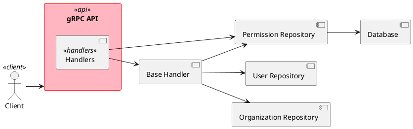

# Архитектура CRUD для сущности "Право"

## Обзор

В данном документе описана архитектура CRUD-операций для сущности "Право" (Permission), которая следует существующим паттернам проекта.

## Структура модели

### Модель Permission

Файл: `internal/models/permission.go`

```go
package models

// Permission представляет сущность права доступа
type Permission struct {
    ID          int    `json:"id"`
    Name        string `json:"name"`
    Code        string `json:"code"`
    Description string `json:"description"`
}
```

## Архитектурные компоненты

### 1. Репозиторий

#### Интерфейс PermissionRepository
Файл: `internal/repository/interface.go`

```go
// PermissionRepository интерфейс для работы с правами
type PermissionRepository interface {
    CreatePermission(ctx context.Context, permission *models.Permission) (*models.Permission, error)
    GetPermissionByID(ctx context.Context, id int) (*models.Permission, error)
    UpdatePermission(ctx context.Context, permission *models.Permission) error
    DeletePermission(ctx context.Context, id int) error
    GetPermissions(ctx context.Context, limit, offset int) ([]*models.Permission, error)
    InitDB() error
}
```

#### Реализация permissionRepository
Файл: `internal/repository/permission_repository.go`

```go
// permissionRepository реализация интерфейса PermissionRepository
type permissionRepository struct {
    db *DB
}

// NewPermissionRepository создает новый репозиторий прав
func NewPermissionRepository(db *DB) PermissionRepository {
    return &permissionRepository{db: db}
}

// CreatePermission создает новое право
func (r *permissionRepository) CreatePermission(ctx context.Context, permission *models.Permission) (*models.Permission, error) {
    query := `INSERT INTO permissions (name, code, description) VALUES ($1, $2, $3) RETURNING id`
    err := r.db.GetConnection().QueryRow(ctx, query, permission.Name, permission.Code, permission.Description).Scan(&permission.ID)
    if err != nil {
        return nil, fmt.Errorf("failed to create permission: %w", err)
    }
    return permission, nil
}

// GetPermissionByID получает право по ID
func (r *permissionRepository) GetPermissionByID(ctx context.Context, id int) (*models.Permission, error) {
    query := `SELECT id, name, code, description FROM permissions WHERE id = $1`
    row := r.db.GetConnection().QueryRow(ctx, query, id)

    permission := &models.Permission{}
    err := row.Scan(&permission.ID, &permission.Name, &permission.Code, &permission.Description)
    if err != nil {
        if err == pgx.ErrNoRows {
            return nil, fmt.Errorf("permission not found")
        }
        return nil, fmt.Errorf("failed to get permission: %w", err)
    }

    return permission, nil
}

// UpdatePermission обновляет информацию о праве
func (r *permissionRepository) UpdatePermission(ctx context.Context, permission *models.Permission) error {
    query := `UPDATE permissions SET name = $1, code = $2, description = $3 WHERE id = $4`
    _, err := r.db.GetConnection().Exec(ctx, query, permission.Name, permission.Code, permission.Description, permission.ID)
    if err != nil {
        return fmt.Errorf("failed to update permission: %w", err)
    }
    return nil
}

// DeletePermission удаляет право
func (r *permissionRepository) DeletePermission(ctx context.Context, id int) error {
    query := `DELETE FROM permissions WHERE id = $1`
    _, err := r.db.GetConnection().Exec(ctx, query, id)
    if err != nil {
        return fmt.Errorf("failed to delete permission: %w", err)
    }
    return nil
}

// GetPermissions получает список прав с ограничением и смещением
func (r *permissionRepository) GetPermissions(ctx context.Context, limit, offset int) ([]*models.Permission, error) {
    query := `SELECT id, name, code, description FROM permissions ORDER BY id LIMIT $1 OFFSET $2`
    rows, err := r.db.GetConnection().Query(ctx, query, limit, offset)
    if err != nil {
        return nil, fmt.Errorf("failed to get permissions: %w", err)
    }
    defer rows.Close()

    var permissions []*models.Permission
    for rows.Next() {
        permission := &models.Permission{}
        err := rows.Scan(&permission.ID, &permission.Name, &permission.Code, &permission.Description)
        if err != nil {
            return nil, fmt.Errorf("failed to scan permission: %w", err)
        }
        permissions = append(permissions, permission)
    }

    if err = rows.Err(); err != nil {
        return nil, fmt.Errorf("failed to iterate permissions: %w", err)
    }

    return permissions, nil
}

// InitDB инициализирует таблицы в БД для прав
func (r *permissionRepository) InitDB() error {
    query := `
CREATE TABLE IF NOT EXISTS permissions (
    id SERIAL PRIMARY KEY,
    name VARCHAR(255) NOT NULL,
    code VARCHAR(255) UNIQUE NOT NULL,
    description TEXT
)`
    _, err := r.db.GetConnection().Exec(context.Background(), query)
    if err != nil {
        return fmt.Errorf("failed to initialize database: %w", err)
    }

    log.Println("PermissionRepository initialized successfully")
    return nil
}
```

### 2. Обработчики

#### Файл: `internal/handlers/permission_create.go`
```go
// CreatePermission общий метод для создания права
func (bh *BaseHandler) CreatePermission(ctx context.Context, in *api_pb.PermissionCreateRequest) (out *api_pb.Permission, err error) {
    // Validate request
    if in.Name == "" || in.Code == "" {
        return nil, status.Error(codes.InvalidArgument, "Name and code are required")
    }

    permission := models.Permission{
        Name:        in.Name,
        Code:        in.Code,
        Description: in.Description,
    }

    // Используем репозиторий для создания права
    dbPermission, err := bh.permissionRepo.CreatePermission(ctx, &permission)
    if err != nil {
        log.Printf("Failed to create permission, err:%v\n", err)
        return nil, status.Error(codes.Internal, "Failed to create permission")
    }

    // Send response
    return &api_pb.Permission{
        Id:          int32(dbPermission.ID),
        Name:        dbPermission.Name,
        Code:        dbPermission.Code,
        Description: dbPermission.Description,
    }, nil
}
```

#### Файл: `internal/handlers/permission_get.go`
```go
// GetPermission общий метод для получения права по ID
func (bh *BaseHandler) GetPermission(ctx context.Context, in *api_pb.Id) (out *api_pb.Permission, err error) {
    // Проверяем входные данные
    if in == nil {
        return nil, status.Error(codes.InvalidArgument, "Invalid argument")
    }

    // Используем репозиторий для получения права
    permission, err := bh.permissionRepo.GetPermissionByID(ctx, int(in.Id))
    if err != nil {
        return nil, status.Error(codes.NotFound, "Permission not found")
    }

    // Возвращаем ответ
    return &api_pb.Permission{
        Id:          int32(permission.ID),
        Name:        permission.Name,
        Code:        permission.Code,
        Description: permission.Description,
    }, nil
}
```

#### Файл: `internal/handlers/permission_update.go`
```go
// UpdatePermission общий метод для обновления права
func (bh *BaseHandler) UpdatePermission(ctx context.Context, in *api_pb.PermissionUpdateRequest) (out *api_pb.Permission, err error) {
    // Проверяем входные данные
    if in == nil || in.Id == 0 {
        return nil, status.Error(codes.InvalidArgument, "Invalid argument")
    }

    // Преобразуем запрос в модель
    permission := models.Permission{
        ID:          int(in.Id),
        Name:        in.Name,
        Code:        in.Code,
        Description: in.Description,
    }

    // Используем репозиторий для обновления права
    if err := bh.permissionRepo.UpdatePermission(ctx, &permission); err != nil {
        log.Printf("update permission failed, err:%v\n", err)
        return nil, status.Error(codes.Internal, "Failed to update permission")
    }

    // Возвращаем ответ
    return &api_pb.Permission{
        Id:          int32(permission.ID),
        Name:        permission.Name,
        Code:        permission.Code,
        Description: permission.Description,
    }, nil
}
```

#### Файл: `internal/handlers/permission_delete.go`
```go
// DeletePermission общий метод для удаления права
func (bh *BaseHandler) DeletePermission(ctx context.Context, req *api_pb.Id) (*api_pb.Empty, error) {
    // Проверяем входные данные
    if req == nil {
        return nil, status.Error(codes.InvalidArgument, "Invalid argument")
    }

    // Используем репозиторий для удаления права
    if err := bh.permissionRepo.DeletePermission(ctx, int(req.GetId())); err != nil {
        return nil, status.Error(codes.Internal, "Failed to delete permission")
    }

    // Возвращаем пустой ответ
    return &api_pb.Empty{}, nil
}
```

#### Файл: `internal/handlers/permissions_get.go`
```go
// GetPermissions получает список прав
func (bh *BaseHandler) GetPermissions(ctx context.Context, in *api_pb.ListRequest) (out *api_pb.PermissionsResponse, err error) {
    // Проверяем входные данные
    if in == nil {
        return nil, status.Error(codes.InvalidArgument, "Invalid argument")
    }

    // Используем репозиторий для получения списка прав
    permissions, err := bh.permissionRepo.GetPermissions(ctx, int(in.Limit), int(in.Offset))
    if err != nil {
        return nil, status.Error(codes.Internal, "Failed to get permissions")
    }

    // Формируем ответ
    var permissionsOut []*api_pb.Permission
    for _, permission := range permissions {
        permissionsOut = append(permissionsOut, &api_pb.Permission{
            Id:          int32(permission.ID),
            Name:        permission.Name,
            Code:        permission.Code,
            Description: permission.Description,
        })
    }

    // Возвращаем ответ
    return &api_pb.PermissionsResponse{
        Data: permissionsOut,
    }, nil
}
```

### 3. gRPC API

#### Обновление файла: `api/grpc/api.proto`

Добавить новые сообщения:
```protobuf
message Permission {
  int32 id = 1;
  string name = 2;
  string code = 3;
  string description = 4;
}

message PermissionCreateRequest {
  string name = 1;
  string code = 2;
  string description = 3;
}

message PermissionUpdateRequest {
  int32 id = 1;
  string name = 2;
  string code = 3;
  string description = 4;
}

message PermissionsResponse {
  repeated Permission data = 1;
}
```

Добавить новые методы в сервис CrudService:
```protobuf
rpc CreatePermission (PermissionCreateRequest) returns (Permission) {
  option (google.api.http) = {
    post: "/api/permissions"
    body: "*"
  };
}
rpc GetPermission (Id) returns (Permission) {
  option (google.api.http) = {
    get: "/api/permission/{id}"
  };
}
rpc UpdatePermission (PermissionUpdateRequest) returns (Permission) {
  option (google.api.http) = {
    put: "/api/permission"
    body: "*"
  };
}
rpc DeletePermission (Id) returns (Empty) {
  option (google.api.http) = {
    delete: "/api/permission/{id}"
  };
}
rpc GetPermissions (ListRequest) returns (PermissionsResponse) {
  option (google.api.http) = {
    get: "/api/permissions"
  };
}
```

### 4. Сервер

Обновить файл `internal/server/server.go` для регистрации новых методов.

## Диаграмма архитектуры



## План реализации

1. Создать модель Permission
2. Добавить интерфейс PermissionRepository
3. Реализовать permissionRepository
4. Создать обработчики CRUD
5. Обновить protobuf-файл
6. Обновить сервер
7. Добавить тесты