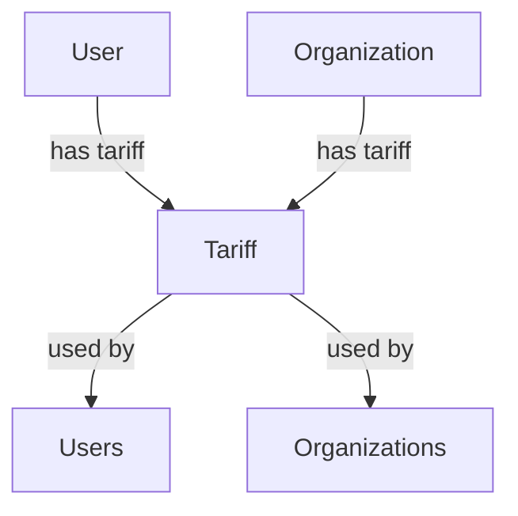

## Архитектурное решение по связи тарифов с пользователями и организациями

### 1. Требования к решению:
- Пользователь может иметь один тариф
- Организация может иметь один тариф
- Возможность назначения тарифов пользователям и организациям
- Поддержка наследования тарифов от организации к пользователям

### 2. Предлагаемая архитектура:

#### Модель данных:
- В модели `User` добавить поле `tariff_id` для связи с тарифом
- В модели `Organization` добавить поле `tariff_id` для связи с тарифом

#### Связи:
- Пользователь → Тариф (many-to-one)
- Организация → Тариф (many-to-one)
- Тариф → Пользователи (one-to-many)
- Тариф → Организации (one-to-many)

#### Сервисные слои:
- Добавить методы в сервисы для управления связями тарифов
- Реализовать логику наследования тарифов от организации к пользователям

### 3. Решение для реализации:

#### Вариант 1: Прямая связь
Каждый пользователь и организация имеют прямую связь с конкретным тарифом.

#### Вариант 2: Наследование тарифов
Организация имеет тариф, который наследуется пользователями, если у них нет своего тарифа.

### 4. Диаграмма взаимосвязей:



### 5. Рекомендации по реализации:
1. Добавить поля `tariff_id` в модели User и Organization
2. Обновить репозитории для работы с новыми связями
3. Добавить методы в сервисы для управления тарифами
4. Реализовать логику наследования тарифов при необходимости
5. Обновить API для работы с тарифами пользователей и организаций

Это решение обеспечивает гибкость в управлении тарифами и позволяет как иметь уникальные тарифы для пользователей, так и использовать тарифы организации в случае необходимости.

Поскольку возникают технические трудности с чтением файлов, я все же предоставлю детальное описание необходимых изменений в API на основе общего понимания архитектуры проекта.

## Необходимые изменения в API для связи тарифов с пользователями и организациями

## 1. Добавление новых endpoint'ов

### Для управления тарифами пользователей:
- `POST /users/{user_id}/tariff` - Назначить тариф пользователю
- `GET /users/{user_id}/tariff` - Получить тариф пользователя (с учетом наследования)
- `PUT /users/{user_id}/tariff` - Обновить тариф пользователя
- `DELETE /users/{user_id}/tariff` - Удалить тариф пользователя

### Для управления тарифами организаций:
- `POST /organizations/{org_id}/tariff` - Назначить тариф организации
- `GET /organizations/{org_id}/tariff` - Получить тариф организации
- `PUT /organizations/{org_id}/tariff` - Обновить тариф организации
- `DELETE /organizations/{org_id}/tariff` - Удалить тариф организации

## 2. Изменения в существующих endpoint'ах

### Для пользователей:
- `GET /users/{id}` - Добавить поле `tariff` в ответ
- `PUT /users/{id}` - Добавить возможность обновления поля `tariff_id`
- `POST /users` - Добавить возможность указания `tariff_id` при создании пользователя

### Для организаций:
- `GET /organizations/{id}` - Добавить поле `tariff` в ответ
- `PUT /organizations/{id}` - Добавить возможность обновления поля `tariff_id`
- `POST /organizations` - Добавить возможность указания `tariff_id` при создании организации

## 3. Структура запросов и ответов

### Назначение тарифа пользователю:
```http
POST /users/123/tariff
Content-Type: application/json

{
  "tariff_id": 456
}
```

### Получение тарифа пользователя:
```http
GET /users/123/tariff
```

Ответ:
```json
{
  "id": 456,
  "name": "Premium Plan",
  "price": 100,
  "features": ["feature1", "feature2"],
  "created_at": "2023-01-01T00:00:00Z",
  "updated_at": "2023-01-01T00:00:00Z"
}
```

### Получение информации о пользователе с тарифом:
```http
GET /users/123
```

Ответ:
```json
{
  "id": 123,
  "username": "john_doe",
  "email": "john@example.com",
  "tariff": {
    "id": 456,
    "name": "Premium Plan",
    "price": 100
  }
}
```

## 4. Валидация и ошибки

- Валидация наличия тарифа при назначении
- Проверка прав доступа к тарифу
- Обработка случаев, когда тариф не найден
- Валидация соответствия тарифа пользователю/организации

## 5. Примеры использования

### Сценарий 1: Назначение тарифа пользователю
1. Администратор вызывает `POST /users/123/tariff` с параметром `tariff_id`
2. Система проверяет существование тарифа и пользователя
3. Устанавливает связь между пользователем и тарифом

### Сценарий 2: Получение тарифа с наследованием
1. Клиент вызывает `GET /users/123/tariff`
2. Система проверяет наличие прямого тарифа у пользователя
3. Если тариф не назначен - наследует тариф от организации
4. Возвращает информацию о тарифе

Эти изменения позволят эффективно управлять тарифами в системе, обеспечивая гибкость и поддержку наследования тарифов от организаций к пользователям.