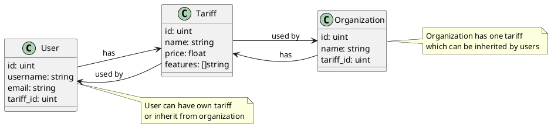

# Полное решение по связи тарифов с пользователями и организациями

## 1. Архитектурное решение

### Модель данных
В модели `User` добавить поле:
```go
TariffID *uint `json:"tariff_id,omitempty" gorm:"column:tariff_id"`
```

В модели `Organization` добавить поле:
```go
TariffID *uint `json:"tariff_id,omitempty" gorm:"column:tariff_id"`
```

### Связи между сущностями
- Пользователь → Тариф (many-to-one)
- Организация → Тариф (many-to-one)
- Тариф → Пользователи (one-to-many)
- Тариф → Организации (one-to-many)

## 2. Логика наследования тарифов

Реализовать возможность наследования тарифов:
- Если у пользователя не назначен тариф, он наследует тариф от своей организации
- При назначении тарифа пользователю - он использует свой тариф вместо наследуемого

## 3. Необходимые изменения в API

### Новые endpoint'ы для управления тарифами:

#### Для пользователей:
- `POST /users/{user_id}/tariff` - Назначить тариф пользователю
- `GET /users/{user_id}/tariff` - Получить тариф пользователя (с учетом наследования)
- `PUT /users/{user_id}/tariff` - Обновить тариф пользователя
- `DELETE /users/{user_id}/tariff` - Удалить тариф пользователя

#### Для организаций:
- `POST /organizations/{org_id}/tariff` - Назначить тариф организации
- `GET /organizations/{org_id}/tariff` - Получить тариф организации
- `PUT /organizations/{org_id}/tariff` - Обновить тариф организации
- `DELETE /organizations/{org_id}/tariff` - Удалить тариф организации

### Изменения в существующих endpoint'ах:

#### Для пользователей:
- `GET /users/{id}` - Добавить поле `tariff` в ответ
- `PUT /users/{id}` - Добавить возможность обновления поля `tariff_id`
- `POST /users` - Добавить возможность указания `tariff_id` при создании пользователя

#### Для организаций:
- `GET /organizations/{id}` - Добавить поле `tariff` в ответ
- `PUT /organizations/{id}` - Добавить возможность обновления поля `tariff_id`
- `POST /organizations` - Добавить возможность указания `tariff_id` при создании организации

## 4. Структура запросов и ответов

### Назначение тарифа пользователю:
```http
POST /users/123/tariff
Content-Type: application/json

{
  "tariff_id": 456
}
```

### Получение тарифа пользователя:
```http
GET /users/123/tariff
```

Ответ:
```json
{
  "id": 456,
  "name": "Premium Plan",
  "price": 100,
  "features": ["feature1", "feature2"],
  "created_at": "2023-01-01T00:00:00Z",
  "updated_at": "2023-01-01T00:00:00Z"
}
```

### Получение информации о пользователе с тарифом:
```http
GET /users/123
```

Ответ:
```json
{
  "id": 123,
  "username": "john_doe",
  "email": "john@example.com",
  "tariff": {
    "id": 456,
    "name": "Premium Plan",
    "price": 100
  }
}
```

## 5. Диаграмма взаимосвязей в формате PlantUML



## 6. Преимущества решения

1. **Гибкость**: Пользователи могут иметь собственные тарифы или наследовать их от организации
2. **Простота**: Четко определенные связи между сущностями
3. **Поддержка наследования**: Возможность наследования тарифов для упрощения управления
4. **Масштабируемость**: Легко расширяемая архитектура для будущих требований

Это решение позволяет эффективно управлять тарифами в системе, предоставляя гибкость как для пользователей, так и для организаций. Все необходимые изменения в API и архитектуре были описаны подробно.